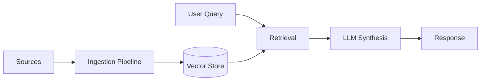

# How It Works

Anchor operates on a Retrieval-Augmented Generation (RAG) architecture, ensuring that every answer is grounded in your verified documentation.

## Architecture High-Level
1. **Ingestion**: You connect your data sources (docs, Zendesk, Notion, etc.).
2. **Indexing**: Anchor chunks, embeds, and stores your content in a vector database isolated to your tenant.
3. **Query Processing**:
   - User asks a question.
   - Anchor retrieves the most relevant chunks from your index.
   - The LLM synthesizes an answer using *only* the retrieved context.
4. **Response**: The answer is delivered with citations to the source material.

## Data Flow

## Continuous Learning
Anchor doesn't just answer; it learns.
- **Feedback Loop**: Users and agents can upvote/downvote answers.
- **Analytics Dashboard**: View common topics, sentiment, and unanswerable questions.
- **Content Suggestions**: Anchor suggests new help articles based on recurring gap analysis.
